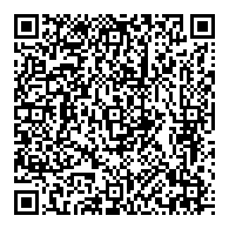
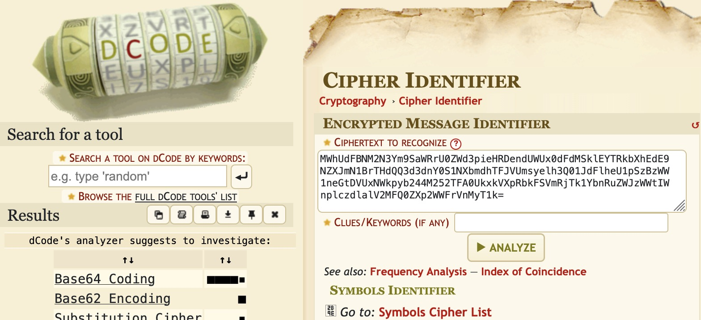
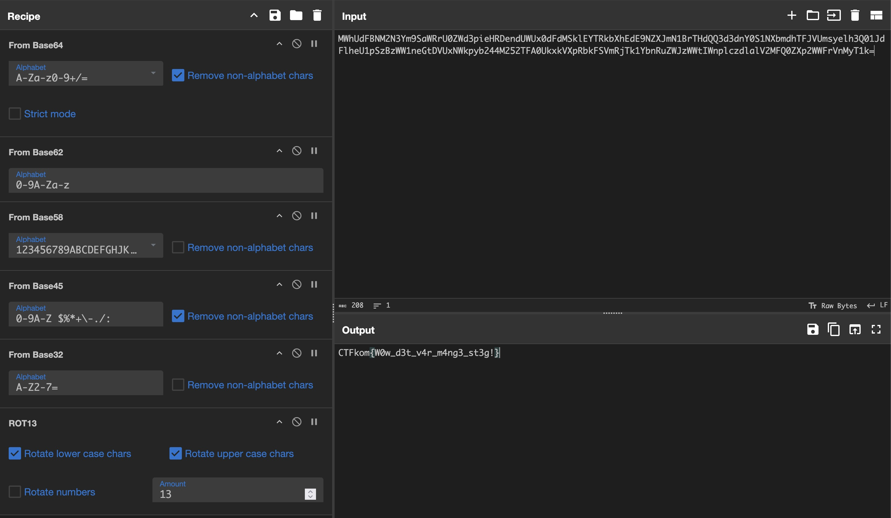

# Task
*You've stumbled upon a mysterious QR code, but scanning it is just the beginning. To uncover the hidden flag, you'll need to peel back multiple layers of encoding—like a well-baked cipher cake.*

*Flag format: CTFkom{flag}*

## Immage attached

# My Sulution
Scanned the QR-code and got the text:

*MWhUdFBNM2N3Ym9SaWRrU0ZWd3pieHRDendUWUx0dFdMSklEYTRkbXhEdE9NZXJmN1BrTHdQQ3d3dnY0S1NXbmdhTFJVUmsyelh3Q01JdFlheU1pSzBzWW1neGtDVUxNWkpyb244M252TFA0UkxkVXpRbkFSVmRjTk1YbnRuZWJzWWtIWnplczdlalV2MFQ0ZXp2WWFrVnMyT1k=*

The name of the QR-code immage indicates that this is the flag, but acording to the text it's hidden behind *multiple layers of encoding*. 

## Step 1
To identify the encoding used, I used the website: https://www.dcode.fr/cipher-identifier. Here it sayed it was *Base64*, as shown on the picture bellow.

## Step 2
For the actual decryption I used the CyberChef program (https://gchq.github.io/CyberChef/) and applied the *From Base64* operation and got the output: *1hTtPM3cwboRidkSFVwzbxtCzwTYLttWLJIDa4dmxDtOMerf7PkLwPCwwvv4KSWngaLRURk2zXwCMItYayMiK0sYmgxkCULMZJron83nvLP4RLdUzQnARVdcNMXntnebsYkHZzes7ejUv0T4ezvYakVs2OY*.

Here I repeated step 1 and 2 until I got this code: *PGSxbz{J0j_q3g_i4e_z4at3_fg3t!}*.

## Step 3
The enctyption used used for the last code looks suspicius like the final flag, just that the letters are rotated. Applied a rotation algorithm, and got *CTFkom{W0w_d3t_v4r_m4ng3_st3g!}* afther 13 rotaons.

# Flag
**CTFkom{W0w_d3t_v4r_m4ng3_st3g!}**