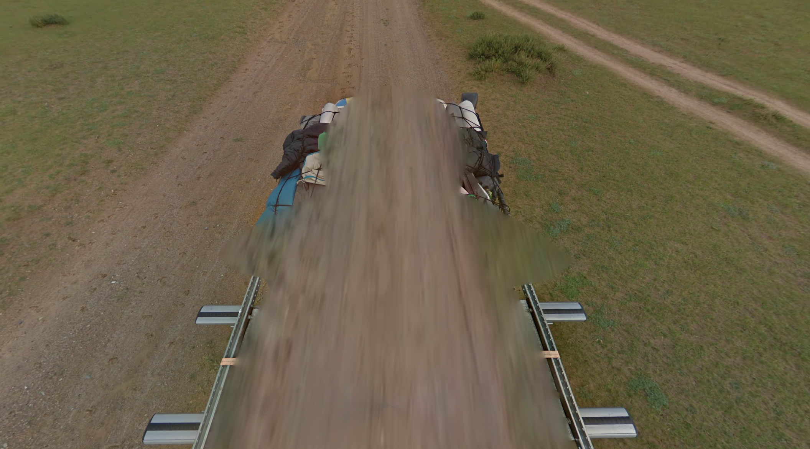
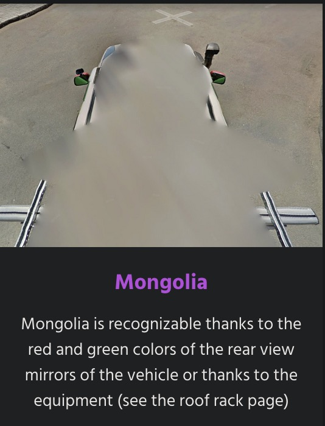

# Task
So i just found this very cool google doc that contains soo much different country metas for geoguessr and some of them are really spesific. Anyways the road in the picture leads up to a very nice looking camp/hotel. What is the name of the camp?

PS: The name from the google maps point of intrest Flag format: CTFkom{NAME OF CAMP}

https://docs.google.com/spreadsheets/d/1UNvkoY-LaktF75nU_cP7-wVRAEvH3fSqVZet20HqxXA

## Image atached

# My Sulution
## Step 1
Looking at the image we can see a screenshot taken from Google Maps. The car has clothes and sleeping gab on the roof and are in what looks like a rural area, according to geomastery (https://geomastery.com/google-car/) does this description fit for Mongolia.

## Step 2
The attatched Google doc has a section for Mongolia and a document called *The Complete Guide to Mongolia*. 