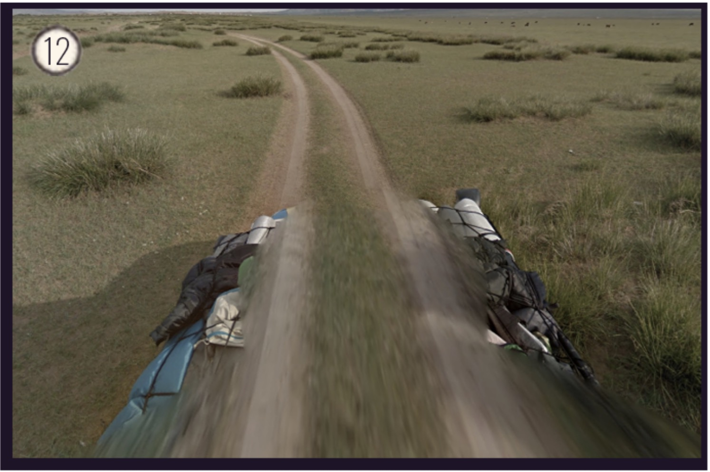
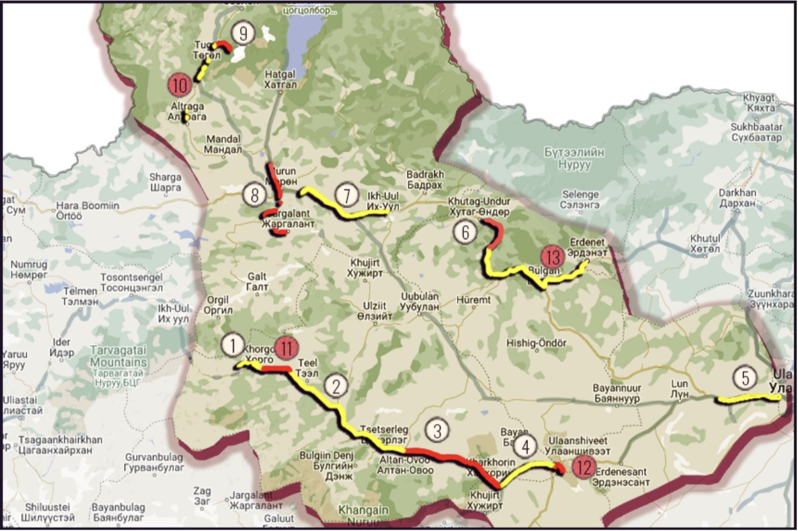
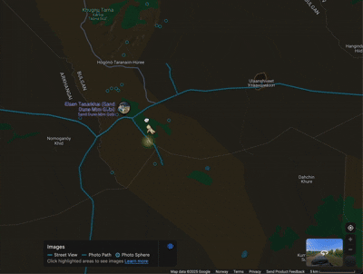
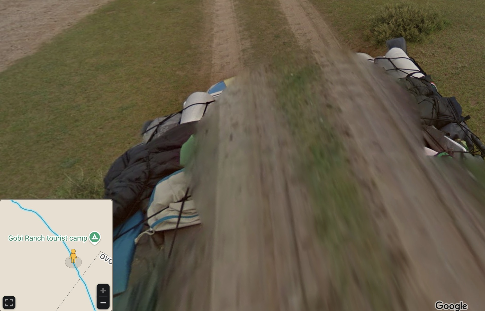

# Task
So i just found this very cool google doc that contains soo much different country metas for geoguessr and some of them are really spesific. Anyways the road in the picture leads up to a very nice looking camp/hotel. What is the name of the camp?

PS: The name from the google maps point of intrest Flag format: CTFkom{NAME OF CAMP}

https://docs.google.com/spreadsheets/d/1UNvkoY-LaktF75nU_cP7-wVRAEvH3fSqVZet20HqxXA

## Image atached

# My Solution
## Step 1
Looking at the image, we can see a screenshot taken from Google Maps. The car has clothes and sleeping bags on the roof and is in what looks like a rural area. According to geomastery (https://geomastery.com/google-car/), does this description fit for Mongolia?

## Step 2
The attached Google doc has a section for Mongolia and a document called *The Complete Guide to Mongolia* (https://docs.google.com/document/d/1qIA0vj9YYH-NseDSGXXSgmz9M65WkFPV5h5vF_WBQ2U/edit?tab=t.0#heading=h.rki4i250pegy). 
There is a similar picture at page 110:

The location of that picture is marked on a map, where we can see it is close to a place called *Ulaanshiveet*.

## Step 3
I found the road by looking at Google Maps at different roads in the area.

## Step 4
The task specifies that we need to find a hotel/camp, and there was one camp close to the road named *Gobi Ranch tourist camp*.

# Flag
**CTFkom{Gobi Ranch tourist camp}**
